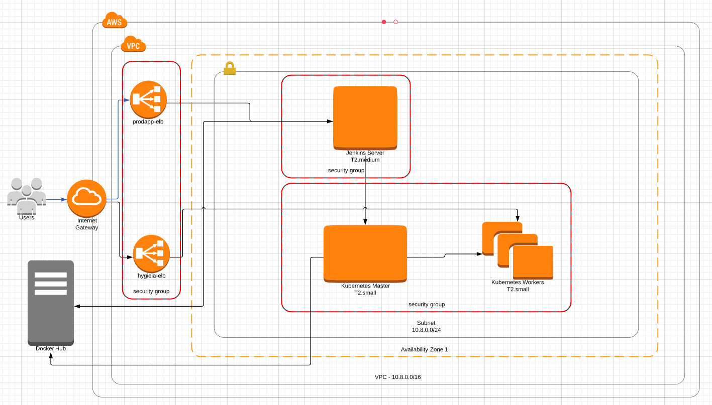

# aws_jenkins_hygieia

 The idea is to have a Hygieia (https://github.com/capitalone/Hygieia) dashboard running on AWS, so you can modify, add or remove components and the Hygieia installation is built and deployed automatically.





**Prerequisites**

* Terraform >= 0.11.7
* Ansible = 2.7.0.dev0

**Installation Process**

* Configure your `AWS_ACCESS_KEY_ID` and your `AWS_SECRET_ACCESS_KEY`
```
 export AWS_ACCESS_KEY_ID=XXXXXXXXX
 export AWS_SECRET_ACCESS_KEY=XXXXXXXXX

```
* Create your Key Pair on the region where is going to be deployed the solution
* Configure your Key file on the `aws-variables.tf`
```
variable "key_pair" {
  default = "new-key-pair"
}

variable "private_key_path" {
  default = "/home/atorres/.ssh/new-key-pair.pem"
}
```
* Execute `terraform plan`
* Execute `terraform apply`

* Jenkins User and password are located at `ansible/roles/jenkins/files/basic-security.groovy`
* Add Maven and Java Paths to Global Tool Configuration
```
Manage Jenkins -> Global Tool Configuration

JDK Instalations-> Add a name
Add JAVA_HOME /usr/java/latest

Uncheck Install Automatially

Maven Instalations-> Add a name
Add  MAVEN_HOME /usr/local/src/maven

Uncheck Install Automatially

Apply and Save
```
* Create the pipeline in Jenkins selecting Maven Project with the git repo parameters and the execution command
```
Git Repository 
  https://github.com/aetorres/Hygieia.git

Add your Git credentials

Pre Steps -> bash
mvn clean install package

I add this step as Post-build Actions, Achive the artifacts -> Files to archive
  collectors/*/*/*/*.jar, api/*/*.jar, api/*/*/*/*.jar, .mvn/*/*.jar, api-audit/*/*.jar, UI-tests/*/*.jar, core/*/*.jar, UI/*/*/*/*/*.jar

Apply and Save
```

* Exeute the build
